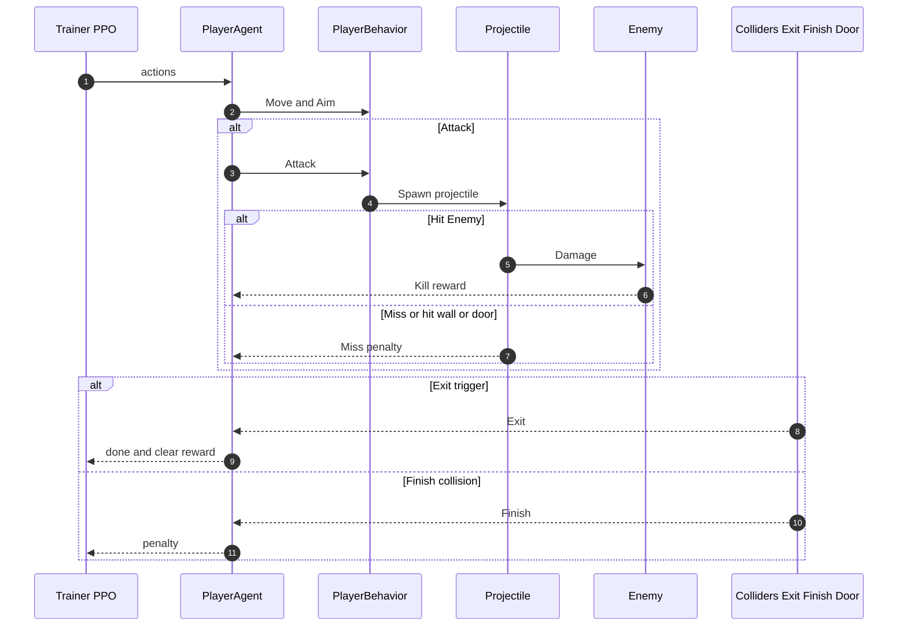
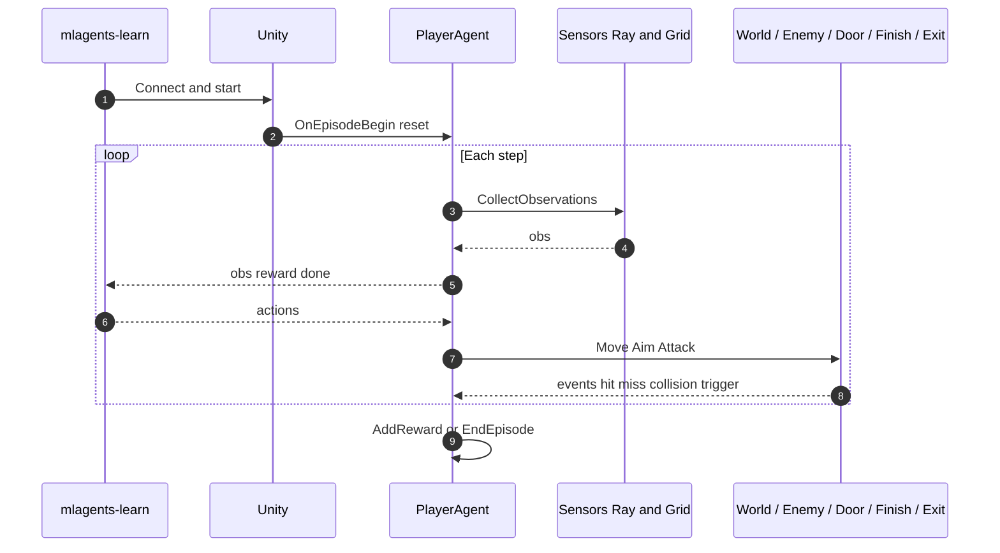
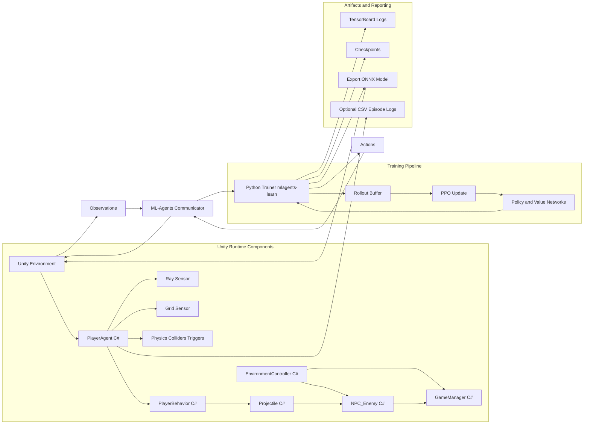
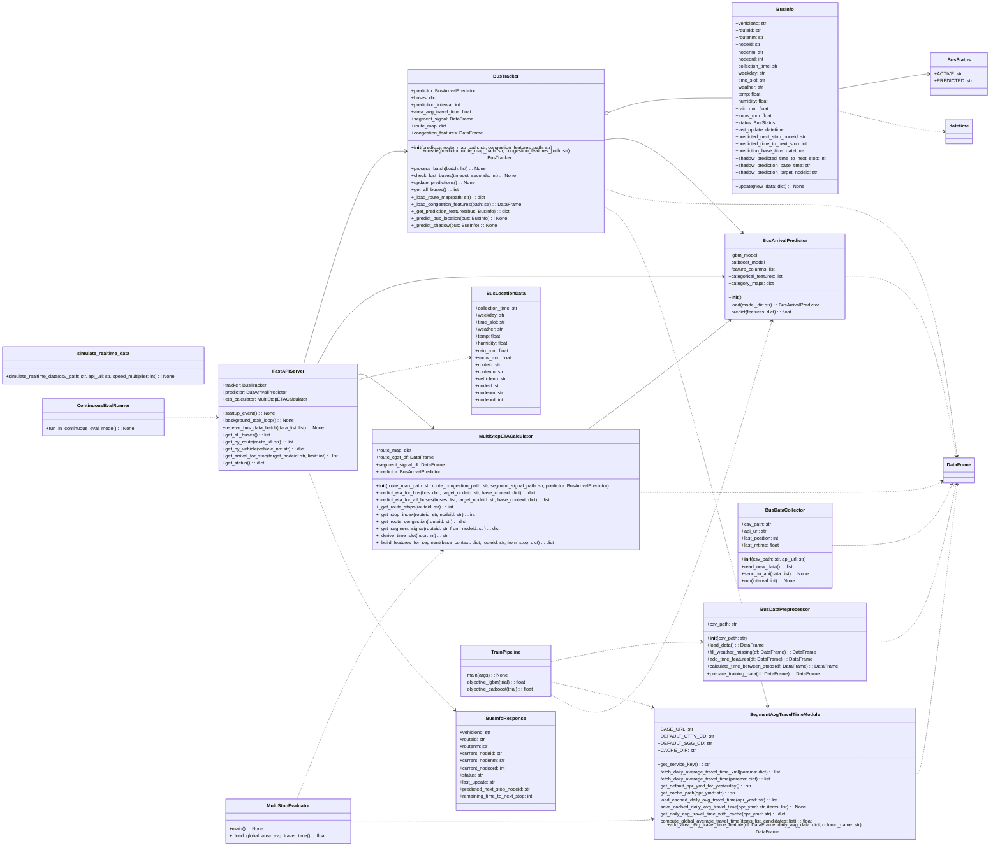

```mermaid
sequenceDiagram
    autonumber
    participant TR as Trainer PPO
    participant PA as PlayerAgent
    participant PB as PlayerBehavior
    participant PS as Projectile
    participant EN as Enemy
    participant PHY as Colliders Exit Finish Door

    TR->>PA: actions
    PA->>PB: Move and Aim
    alt Attack
        PA->>PB: Attack
        PB->>PS: Spawn projectile
        alt Hit Enemy
            PS->>EN: Damage
            EN-->>PA: Kill reward
        else Miss or hit wall or door
            PS-->>PA: Miss penalty
        end
    end
    alt Exit trigger
        PHY-->>PA: Exit
        PA-->>TR: done and clear reward
    else Finish collision
        PHY-->>PA: Finish
        PA-->>TR: penalty
    end
```

```mermaid
sequenceDiagram
    autonumber
    participant TR as mlagents-learn
    participant UE as Unity
    participant PA as PlayerAgent
    participant S as Sensors Ray and Grid
    participant W as World / Enemy / Door / Finish / Exit

    TR->>UE: Connect and start
    UE->>PA: OnEpisodeBegin reset
    loop Each step
        PA->>S: CollectObservations
        S-->>PA: obs
        PA-->>TR: obs reward done
        TR-->>PA: actions
        PA->>W: Move Aim Attack
        W-->>PA: events hit miss collision trigger
    end
    PA->>PA: AddReward or EndEpisode
```

```mermaid
flowchart LR
    UE[Unity Environment] --> O[Observations]
    O --> COM[ML-Agents Communicator]
    COM --> TR[Python Trainer mlagents-learn]

    TR --> A[Actions]
    A --> COM
    COM --> UE

    subgraph UnitySide[Unity Runtime Components]
        AG[PlayerAgent C#]
        PB[PlayerBehavior C#]
        EC[EnvironmentController C#]
        GM[GameManager C#]
        EN[NPC_Enemy C#]
        PR[Projectile C#]
        SS[Ray Sensor]
        GS[Grid Sensor]
        PHY[Physics Colliders Triggers]
        UE --> AG
        AG --> PB
        AG --> SS
        AG --> GS
        AG --> PHY
        EC --> EN
        EC --> GM
        PB --> PR
        PR --> EN
        EN --> GM
    end

    subgraph TrainerSide[Training Pipeline]
        PPO[PPO Update]
        BUF[Rollout Buffer]
        NET[Policy and Value Networks]
        TR --> BUF
        BUF --> PPO
        PPO --> NET
        NET --> TR
    end

    subgraph Outputs[Artifacts and Reporting]
        TB[TensorBoard Logs]
        CKPT[Checkpoints]
        ONNX[Export ONNX Model]
        CSV[Optional CSV Episode Logs]
        TR --> TB
        TR --> CKPT
        TR --> ONNX
        AG --> CSV
    end

    ONNX --> UE
```

```mermaid
classDiagram
direction LR

%% ===== Common placeholders =====
class DataFrame
class datetime

%% =========================
%% data_preprocessing.py
%% =========================
class BusDataPreprocessor {
  +csv_path: str
  +__init__(csv_path: str)
  +load_data(): DataFrame
  +fill_weather_missing(df: DataFrame): DataFrame
  +add_time_features(df: DataFrame): DataFrame
  +calculate_time_between_stops(df: DataFrame): DataFrame
  +prepare_training_data(df: DataFrame): DataFrame
}
BusDataPreprocessor ..> DataFrame

%% =========================
%% bus_predictor.py
%% =========================
class BusArrivalPredictor {
  +lgbm_model
  +catboost_model
  +feature_columns: list
  +categorical_features: list
  +category_maps: dict
  +__init__()
  +load(model_dir: str): BusArrivalPredictor
  +predict(features: dict): float
}
BusArrivalPredictor ..> DataFrame

%% =========================
%% segment_avg_travel_time.py
%% =========================
class SegmentAvgTravelTimeModule {
  +BASE_URL: str
  +DEFAULT_CTPV_CD: str
  +DEFAULT_SGG_CD: str
  +CACHE_DIR: str

  +get_service_key(): str
  +fetch_daily_average_travel_time_xml(params: dict): list
  +fetch_daily_average_travel_time(params: dict): list

  +get_default_opr_ymd_for_yesterday(): str
  +get_cache_path(opr_ymd: str): str
  +load_cached_daily_avg_travel_time(opr_ymd: str): list
  +save_cached_daily_avg_travel_time(opr_ymd: str, items: list): None

  +get_daily_avg_travel_time_with_cache(opr_ymd: str): dict
  +compute_global_average_travel_time(items: list, candidates: list): float
  +add_area_avg_travel_time_feature(df: DataFrame, daily_avg_data: dict, column_name: str): DataFrame
}
SegmentAvgTravelTimeModule ..> DataFrame

%% =========================
%% bus_tracker.py
%% =========================
class BusStatus {
  +ACTIVE: str
  +PREDICTED: str
}

class BusInfo {
  +vehicleno: str
  +routeid: str
  +routenm: str
  +nodeid: str
  +nodenm: str
  +nodeord: int

  +collection_time: str
  +weekday: str
  +time_slot: str
  +weather: str
  +temp: float
  +humidity: float
  +rain_mm: float
  +snow_mm: float

  +status: BusStatus
  +last_update: datetime

  +predicted_next_stop_nodeid: str
  +predicted_time_to_next_stop: int
  +prediction_base_time: datetime

  +shadow_predicted_time_to_next_stop: int
  +shadow_prediction_base_time: str
  +shadow_prediction_target_nodeid: str

  +update(new_data: dict): None
}

class BusTracker {
  +predictor: BusArrivalPredictor
  +buses: dict
  +prediction_interval: int

  +area_avg_travel_time: float
  +segment_signal: DataFrame
  +route_map: dict
  +congestion_features: DataFrame

  +__init__(predictor, route_map_path: str, congestion_features_path: str)
  +create(predictor, route_map_path: str, congestion_features_path: str): BusTracker

  +process_batch(batch: list): None
  +check_lost_buses(timeout_seconds: int): None
  +update_predictions(): None
  +get_all_buses(): list

  +_load_route_map(path: str): dict
  +_load_congestion_features(path: str): DataFrame
  +_get_prediction_features(bus: BusInfo): dict
  +_predict_bus_location(bus: BusInfo): None
  +_predict_shadow(bus: BusInfo): None
}

BusInfo --> BusStatus
BusInfo ..> datetime
BusTracker o-- BusInfo
BusTracker --> BusArrivalPredictor
BusTracker ..> DataFrame
BusTracker ..> SegmentAvgTravelTimeModule

%% =========================
%% data_collector.py
%% =========================
class BusDataCollector {
  +csv_path: str
  +api_url: str
  +last_position: int
  +last_mtime: float

  +__init__(csv_path: str, api_url: str)
  +read_new_data(): list
  +send_to_api(data: list): None
  +run(interval: int): None
}
BusDataCollector ..> DataFrame

class simulate_realtime_data {
  +simulate_realtime_data(csv_path: str, api_url: str, speed_multiplier: int): None
}

%% =========================
%% multi_stop_eta.py
%% =========================
class MultiStopETACalculator {
  +route_map: dict
  +route_cgst_df: DataFrame
  +segment_signal_df: DataFrame
  +predictor: BusArrivalPredictor

  +__init__(route_map_path: str, route_congestion_path: str, segment_signal_path: str, predictor: BusArrivalPredictor)
  +predict_eta_for_bus(bus: dict, target_nodeid: str, base_context: dict): dict
  +predict_eta_for_all_buses(buses: list, target_nodeid: str, base_context: dict): list

  +_get_route_stops(routeid: str): list
  +_get_stop_index(routeid: str, nodeid: str): int
  +_get_route_congestion(routeid: str): dict
  +_get_segment_signal(routeid: str, from_nodeid: str): dict
  +_derive_time_slot(hour: int): str
  +_build_features_for_segment(base_context: dict, routeid: str, from_stop: dict): dict
}
MultiStopETACalculator --> BusArrivalPredictor
MultiStopETACalculator ..> DataFrame

%% =========================
%% main.py (API models)
%% =========================
class BusLocationData {
  +collection_time: str
  +weekday: str
  +time_slot: str
  +weather: str
  +temp: float
  +humidity: float
  +rain_mm: float
  +snow_mm: float
  +routeid: str
  +routenm: str
  +vehicleno: str
  +nodeid: str
  +nodenm: str
  +nodeord: int
}

class BusInfoResponse {
  +vehicleno: str
  +routeid: str
  +routenm: str
  +current_nodeid: str
  +current_nodenm: str
  +current_nodeord: int
  +status: str
  +last_update: str
  +predicted_next_stop_nodeid: str
  +remaining_time_to_next_stop: int
}

class FastAPIServer {
  +tracker: BusTracker
  +predictor: BusArrivalPredictor
  +eta_calculator: MultiStopETACalculator

  +startup_event(): None
  +background_task_loop(): None
  +receive_bus_data_batch(data_list: list): None
  +get_all_buses(): list
  +get_by_route(route_id: str): list
  +get_by_vehicle(vehicle_no: str): dict
  +get_arrival_for_stop(target_nodeid: str, limit: int): list
  +get_status(): dict
}

FastAPIServer --> BusTracker
FastAPIServer --> BusArrivalPredictor
FastAPIServer --> MultiStopETACalculator
FastAPIServer ..> BusLocationData
FastAPIServer ..> BusInfoResponse

%% =========================
%% scripts (high-level)
%% =========================
class TrainPipeline {
  +main(args): None
  +objective_lgbm(trial): float
  +objective_catboost(trial): float
}
TrainPipeline ..> BusDataPreprocessor
TrainPipeline ..> SegmentAvgTravelTimeModule
TrainPipeline ..> BusArrivalPredictor

class MultiStopEvaluator {
  +main(): None
  +_load_global_area_avg_travel_time(): float
}
MultiStopEvaluator ..> MultiStopETACalculator
MultiStopEvaluator ..> SegmentAvgTravelTimeModule

class ContinuousEvalRunner {
  +run_in_continuous_eval_mode(): None
}
ContinuousEvalRunner ..> FastAPIServer
```
