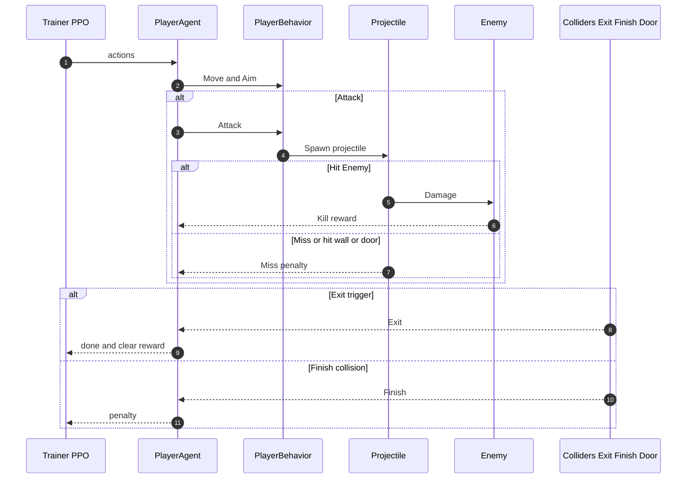
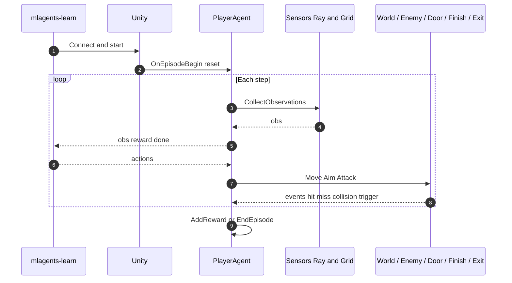

```mermiad
flowchart LR
    UE[Unity Environment] --> O[Observations]
    O --> COM[ML-Agents Communicator]
    COM --> TR[Python Trainer mlagents-learn]

    TR --> A[Actions]
    A --> COM
    COM --> UE

    subgraph UnitySide[Unity Runtime Components]
        AG[PlayerAgent C#]
        PB[PlayerBehavior C#]
        EC[EnvironmentController C#]
        GM[GameManager C#]
        EN[NPC_Enemy C#]
        PR[Projectile C#]
        SS[Ray Sensor]
        GS[Grid Sensor]
        PHY[Physics Colliders Triggers]
        UE --> AG
        AG --> PB
        AG --> SS
        AG --> GS
        AG --> PHY
        EC --> EN
        EC --> GM
        PB --> PR
        PR --> EN
        EN --> GM
    end

    subgraph TrainerSide[Training Pipeline]
        PPO[PPO Update]
        BUF[Rollout Buffer]
        NET[Policy and Value Networks]
        TR --> BUF
        BUF --> PPO
        PPO --> NET
        NET --> TR
    end

    subgraph Outputs[Artifacts and Reporting]
        TB[TensorBoard Logs]
        CKPT[Checkpoints]
        ONNX[Export ONNX Model]
        CSV[Optional CSV Episode Logs]
        TR --> TB
        TR --> CKPT
        TR --> ONNX
        AG --> CSV
    end

    ONNX --> UE
```
