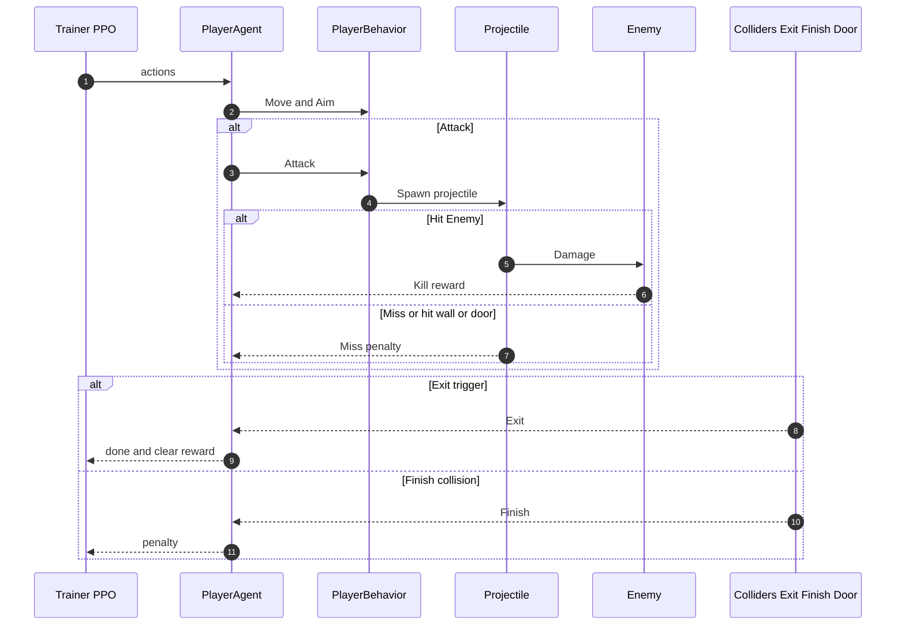
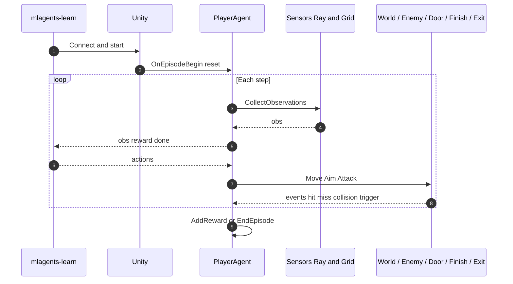

```mermaid
sequenceDiagram
    autonumber
    participant TR as Trainer PPO
    participant PA as PlayerAgent
    participant PB as PlayerBehavior
    participant PS as Projectile
    participant EN as Enemy
    participant PHY as Colliders Exit Finish Door

    TR->>PA: actions
    PA->>PB: Move and Aim
    alt Attack
        PA->>PB: Attack
        PB->>PS: Spawn projectile
        alt Hit Enemy
            PS->>EN: Damage
            EN-->>PA: Kill reward
        else Miss or hit wall or door
            PS-->>PA: Miss penalty
        end
    end
    alt Exit trigger
        PHY-->>PA: Exit
        PA-->>TR: done and clear reward
    else Finish collision
        PHY-->>PA: Finish
        PA-->>TR: penalty
    end
```

```mermaid
sequenceDiagram
    autonumber
    participant TR as mlagents-learn
    participant UE as Unity
    participant PA as PlayerAgent
    participant S as Sensors Ray and Grid
    participant W as World / Enemy / Door / Finish / Exit

    TR->>UE: Connect and start
    UE->>PA: OnEpisodeBegin reset
    loop Each step
        PA->>S: CollectObservations
        S-->>PA: obs
        PA-->>TR: obs reward done
        TR-->>PA: actions
        PA->>W: Move Aim Attack
        W-->>PA: events hit miss collision trigger
    end
    PA->>PA: AddReward or EndEpisode
```
